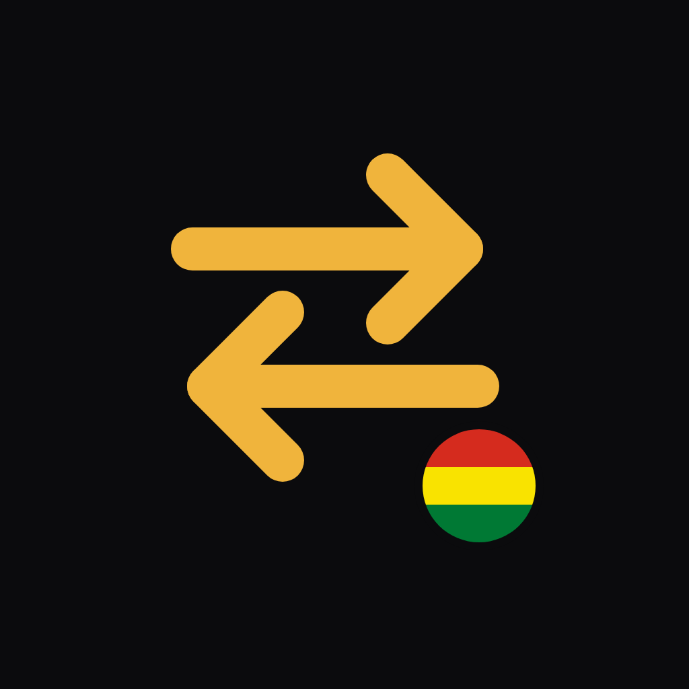

# Cambista

Meet Cambista: the US dollar exchange rate in Bolivia, on your phone. See the **official BCB rate** next to the **parallel P2P rate (USDT on Binance)**, the **gap** between them, and a calculator that tells you how much you really get. It updates itself once a day, at the time you choose, and sends you a notification.

📊 **OFFICIAL VS PARALLEL AT A GLANCE:**
The Today screen shows the official rate from the Central Bank of Bolivia (with its validity dates), the P2P buy, sell and average prices, and the gap = P2P / BCB − 1, explained in plain words.

🏦 **BANK BY BANK:**
See what each Bolivian bank pays for your dollar, from the BCB's daily table: the price, the dollars traded and the number of trades, the best bank of the day and the weighted median, compared with selling on P2P.

🧮 **BUILT-IN CALCULATOR:**
Choose "I have dollars" or "I have bolivianos" and see what you get at the official rate, at the bank and on P2P, plus the difference. P2P uses the price you are paid when you sell and the price you pay when you buy.

📈 **DAILY HISTORY & CHART:**
One reading per day, saved on your phone, with a chart of the last 30 days and the gap for each day. Export it to CSV for Excel or Google Sheets, and import it back on a new phone.

⏰ **AUTOMATIC DAILY UPDATE:**
Pick a time and Cambista checks the rates in the background, even when the app is closed, and notifies you with the BCB rate, the P2P rate and the gap.

🛟 **RELIABLE SOURCES WITH BACKUPS:**
If a main source fails, Cambista falls back to another one and tells you which source each number came from.

| Data | Main source | Other sources (if the main one fails) |
|---|---|---|
| Official dollar | Home page of the [BCB](https://www.bcb.gob.bo/) ("Tipo de cambio oficial") | DolarApi `/v1/dolares/oficial` |
| Banks | [BCB](https://www.bcb.gob.bo/bcb_tco_publico_ultima_cotizacion.php): buying rate of each financial institution | — |
| Parallel dollar | Binance P2P USDT/BOB: median of the first N buy and sell ads | [paralelo.bo](https://paralelo.bo/api) (data under CC BY 4.0), then DolarApi |

🔐 **PRIVACY FIRST:**
No accounts, no analytics, no location permission, no server. Your settings and history never leave your phone.

🌐 **SPANISH & ENGLISH:**
Use the phone's language or choose Español or English in Settings. Numbers and the daily notification follow the language you pick.

🌙 **CLEAN, MODERN DESIGN:**
Dark, OLED (pure black) and light themes, or follow the system, large numbers that are easy to read, and a simple five-tab layout.

## Install

1. On your phone, open the [latest release](https://github.com/dani3lsamir/cambista/releases/latest) and download `Cambista.apk`.
2. Open the APK on your Android phone and allow "install unknown apps" for your browser or file manager.

New versions install over the old one without losing your history.

## For developers

Build, test and project structure notes (in Spanish) are in [docs/DESARROLLO.md](docs/DESARROLLO.md). Planned features are in [docs/ROADMAP.md](docs/ROADMAP.md).

## Disclaimer

Cambista is for information only. Rates can change at any time and are not an offer to buy or sell.

## License

Copyright (C) 2026 dani3lsamir

Cambista is free software: you can redistribute it and/or modify it under the terms of the
[GNU General Public License](LICENSE) as published by the Free Software Foundation, either
version 3 of the License, or (at your option) any later version. It is distributed in the hope
that it will be useful, but WITHOUT ANY WARRANTY; without even the implied warranty of
MERCHANTABILITY or FITNESS FOR A PARTICULAR PURPOSE. See the GNU General Public License for
more details.
