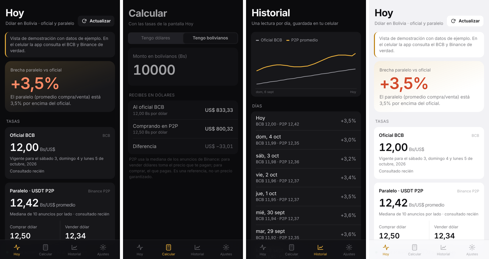

# Cambista

Tipo de cambio del dólar en Bolivia, en el celular: **oficial del BCB** frente al **paralelo P2P (USDT en Binance)**, la **brecha** entre los dos y una calculadora. Se actualiza sola una vez al día, a la hora que elijas, y te avisa con una notificación.

## Qué hace

| Pantalla | Para qué |
|---|---|
| **Hoy** | Oficial BCB (con su vigencia), paralelo P2P (comprar, vender, promedio) y brecha = P2P / BCB − 1 |
| **Calcular** | "Tengo dólares" o "Tengo bolivianos": cuánto recibes al oficial y en P2P, y la diferencia |
| **Historial** | Un registro por día guardado en el celular, con gráfico de los últimos 30 días |
| **Ajustes** | Actualización diaria (sí/no y hora), notificación, precio para la brecha, anuncios para la mediana, tema (sistema, oscuro, OLED, claro) |

## De dónde salen los datos

| Dato | Fuente principal | Otras fuentes (si la principal falla) |
|---|---|---|
| Dólar oficial | Página de inicio del [BCB](https://www.bcb.gob.bo/) ("Tipo de cambio oficial") | DolarApi `/v1/dolares/oficial` |
| Dólar paralelo | Binance P2P USDT/BOB: mediana de los primeros N anuncios de compra y de venta | [paralelo.bo](https://paralelo.bo/api) (datos CC BY 4.0), luego DolarApi |

En P2P, **comprar dólar** es lo que pagas por 1 USDT, y **vender dólar** es lo que te pagan.

## Cómo instalarla

1. En el celular, abre la página de [Releases](https://github.com/dani3lsamir/cambista/releases/latest) y descarga `Cambista.apk`.
2. Ábrelo y, si Android lo pide, permite "instalar apps de origen desconocido" para tu navegador o tu gestor de archivos.
3. Las versiones nuevas se instalan encima de la anterior sin perder tu historial.

## Aviso

Cambista es informativa. Las tasas pueden cambiar en cualquier momento y no son una oferta de compra o venta.

## Licencia

© 2026 dani3lsamir. Todos los derechos reservados. Ver [LICENSE](LICENSE).
